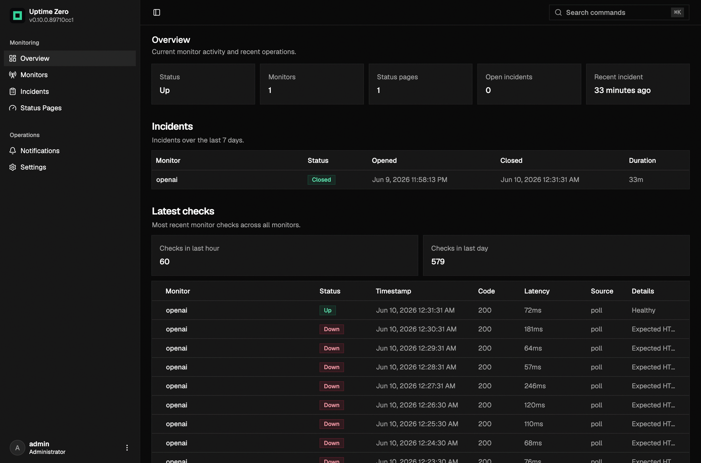

# Uptime Zero

**Simple self-hostable uptime monitoring, built to run on Cloudflare.**

[](https://deploy.workers.cloudflare.com/?url=https://github.com/wsehl/uptime)

Uptime Zero is heavily inspired by [Uptime Kuma](https://github.com/louislam/uptime-kuma) and [OpenStatus](https://github.com/openstatusHQ/openstatus), but built for people who want a simple monitor dashboard, public status pages, and webhook alerts without keeping a separate server around.

> [!WARNING]
> Uptime Zero is still early-stage software. Expect breaking changes, rough edges, and missing pieces while the project is actively taking shape.

## Live Demo

Try the hosted demo at [uptime-zero-demo.anyranges.workers.dev](https://uptime-zero-demo.anyranges.workers.dev/).

```txt
Email: admin@gmail.com
Password: AdminPass24!
```

## Preview



## ✨ Features

- HTTP and DNS uptime monitors
- Public status pages for sharing service health
- Incident history from monitor state changes
- Webhook alerts when monitors change state
- Configurable retention for monitor checks and incidents
- Cloudflare-native runtime with Workers, D1, Durable Objects, and scheduled triggers

## 🚀 Deploy

The full deployment guide is in [docs/deployment.md](docs/deployment.md).

For the short version, install dependencies, log in to Cloudflare, and create the D1 database:

```sh
pnpm install
pnpm wrangler login
pnpm wrangler d1 create uptime-zero
```

Paste the returned D1 `database_id` into `wrangler.jsonc`, then set the auth secrets and deploy:

```sh
pnpm wrangler secret put BETTER_AUTH_SECRET
pnpm wrangler secret put BETTER_AUTH_URL
pnpm run deploy
```

After deploy, open `/setup` on your Worker URL and create the first admin account.

## 🛠️ Local Development

```sh
pnpm install
pnpm run db:migrate
pnpm run dev
```

The local Worker runs on `http://localhost:5173`

## 🧱 Stack

- Cloudflare Workers
- Cloudflare D1
- Cloudflare Durable Objects
- React 19
- TanStack Router
- Hono
- Drizzle ORM
- Better Auth
- shadcn/ui
